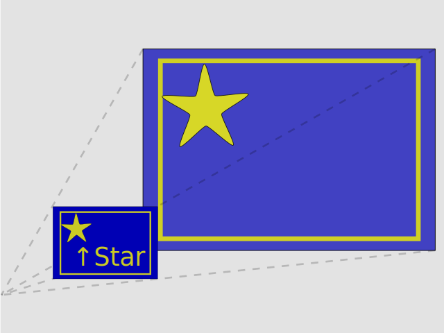
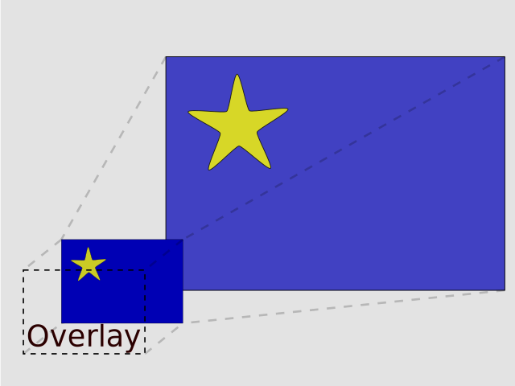
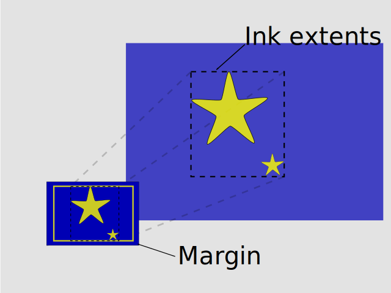

# LuxorLayout

This adds layout functionality to [Luxor.jl](https://github.com/JuliaGraphics/Luxor.jl). 

It also "fixes" Cairo's issue [#349](https://github.com/JuliaGraphics/Cairo.jl/issues/349) by pinning Pango to a version fully working on Windows.

The package is registered in registry [M8](https://github.com/hustf/M8):
To use:

```
(@v1.9) pkg> registry add https://github.com/hustf/M8
julia> using LuxorLayout
julia> import Luxor
julia> using Luxor: circle, etc.... 
```

This loads LuxorLayout's [public interface](#Public-interface).


## Paper space and model space
Users are familiar with [Luxor.jl](https://github.com/JuliaGraphics/Luxor.jl), where the basic use case is how to draw pixels on a screen and save to an image file. The user threshold is low. This package separates the mental model into 'model space' and 'paper space':



You will be drawing in 'model space' (figure right) and annotating in 'paper space' (figure left). 'Paper space' works like a window, where width and breadth equals the intended output image file. Annotations are temporary writing on that window for a particular snapshot.

In paper space, readable text should be in a readable size, e.g. 12 pixels. Margins are also relative to paper space. 

In model space, Luxor (based on [Cairo](https://github.com/JuliaGraphics/Cairo.jl)) does not need to know if '1' is one kilometer or centimeter. Model space is actually boundless. Model space coordinates are unitless, but you will often have a length unit in mind. 

## What this package adds 
### Overlay



This packackage adds an 'overlay'. Every time we take a snapshot, i.e. project model space onto paper space and generate an image file, we can also overlay an annotation drawing. The overlay is generated in a separate thread, and does not inherit the current line width, color, coordinate system, etcetera. We also provide transformation functions, in case you will want to point an arrow at that star.

### Margin and ink extents


This package also helps keep track of ink extents (the rectangle in model space in which you have drawn). It will scale ink extents to fit within paper space margins. This would otherwise be a rather tedious task, especially when rotated coordinate systems are involved.


### It can count, too
As you build a model, making up names for files get tedious. `snap` makes sequential file names. 


## Other words for model and paper space

We like the mental model of 'Model space' and 'Paper space'. It comes from AutoCAD, the Excel of computer aided design. The mental model in Cairo documentation is better for implementing the program.

 Still, we keep the terminology from Cairo (and Luxor) in function names and code. Here is an arguable translation table:


| Application | Window              |  Model          |
|:-----       |:----                |:----            |
|AutoCAD      |Paper space          |Model space      |
|Luxor        |Drawing              |World coordinates| 
|Cairo        |Surface              |Device space     |
|             |Destination          |Source           |

We should add all kinds of caveats here, mainly: 

    -'Source' and 'Destination' is used to describe other relations. 
    -'User space' begs for a mention here. But no!

  ### Public interface

See inline documentation for more.
<details>

 1. Margin and limiting width or height

    * margin_get
    * margin_set
    * Margin

 2. Inkextent
    * encompass
    * inkextent_user_with_margin
    * inkextent_reset
    * inkextent_user_get
    * inkextent_device_get
    * point_device_get
    * point_user_get

 3. Overlay file

    * text_on_overlay

 4. Snap

     -> png and svg sequential files

     -> png in memory

     Uses a second thread to add overlays

    * snap
    * countimage_setvalue

 5. Utilities for user and debugging

     * mark_inkextent
     * mark_cs
     * rotation_device_get
     * distance_to_device_origin_get

</details>


  ### All functions, structured

  But first, check out the public interface functions.

<details>
 1. Margins and limiting width or height

    margin_get, margin_set, Margin, 
    scale_limiting_get,
    LIMITING_WIDTH[], LIMITING_HEIGHT[]

 2. Inkextent

```
    encompass, inkextent_user_with_margin,
    inkextent_reset, inkextent_user_get, 
    inkextent_set, inkextent_device_get, 
    point_device_get, point_user_get
```

 3. Overlay file

    This is normally run in a second thread with a separate Cairo instance.
```
    byte_description, overlay_file,
    assert_second_thread, assert_file_exists,
    text_on_overlay
```

 4. Snap

     -> png and svg sequential files

     -> png in memory uses a second thread to add overlays.

```
    snap, countimage, countimage_setvalue,
    text_on_overlay
```

 5. Utilities for user and debugging

```
     mark_inkextent, mark_cs, 
     rotation_device_get, distance_to_device_origin_get
```

</details>
